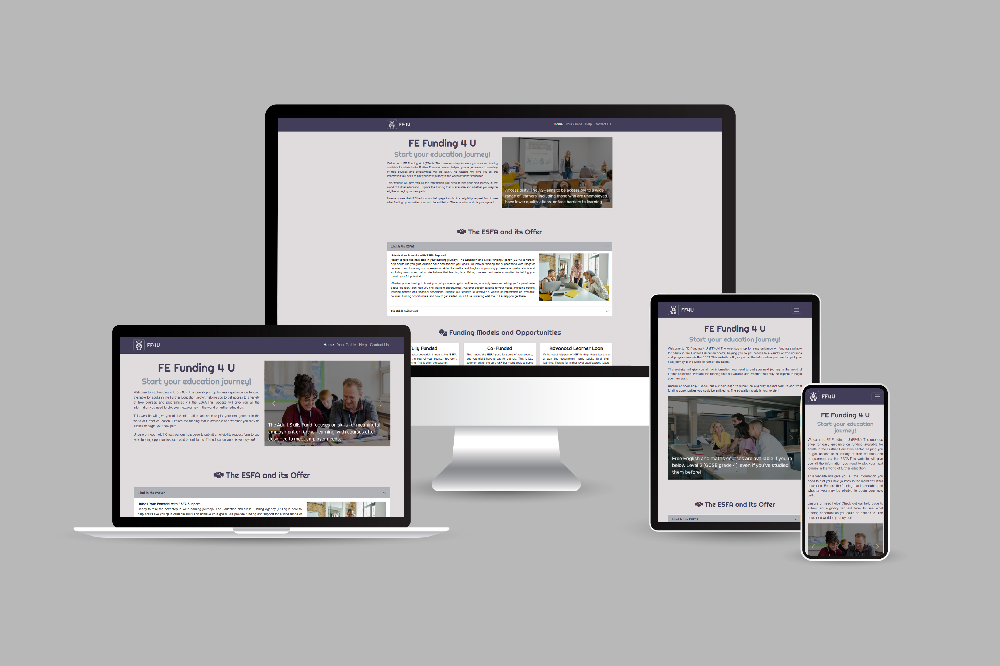

# FE Funding 4 U (FF4U) - Milestone Project 1

**A website providing easy guidance on funding available for adults in the Further Education sector in England.**



## 1. Overview

FE Funding 4 U (FF4U) is a website designed to simplify the often-complex process of finding funding for Further Education courses in England. It targets adults who are considering returning to education or upskilling but are unsure about the financial support available.

The site provides clear information about the Education and Skills Funding Agency (ESFA), the Adult Skills Fund (ASF), various funding models (fully funded, co-funded, loans), and links to key resources. The goal is to empower users to explore their funding options and confidently embark on their learning journey.

This project focuses on creating a responsive and user-friendly website with a clear information architecture. It addresses accessibility considerations and follows best practices for web development.

## 2. User Experience (UX)

### User Stories

#### Feature 1: Easy Navigation and Understanding

- **As a user,** I want the website to be easy to navigate and understand, even if I'm not familiar with funding terminology. I want clear explanations of acronyms and jargon.

  **Acceptance Criteria:**

  - The website has a clear and intuitive navigation menu.
  - A consistent page layout is used throughout the site.
  - The website uses clear and concise language.

  **Tasks:**
  - Design and implement the navigation menu.
  - Create a consistent page template.
  - Review all content for clarity and conciseness.
  - Conduct usability testing to ensure ease of navigation.

#### Feature 2: Mobile Responsiveness

- **As a user on a mobile device,** I want the website to be responsive and display correctly on my smaller screen, ensuring a seamless experience.

  **Acceptance Criteria:**

  - The website adapts to different screen sizes and orientations.
  - The layout, images, and text resize appropriately on mobile devices.
  - The website is usable on touchscreens.

  **Tasks:**
  - Implement responsive design using CSS media queries and Bootstrap.
  - Test the website on various mobile devices and screen sizes.
  - Ensure touch screen compatibility.

#### Feature 3: Information about ESFA

- **As a potential student,** I want to easily find information about the ESFA and its role in funding adult education so that I can understand the overall funding landscape.

  **Acceptance Criteria:**

  - A dedicated section on the ESFA is present on the website.
  - The section explains the ESFA's mission and responsibilities related to adult education funding.
  - The information is presented in clear, concise language, avoiding jargon or providing definitions for technical terms.
  - Links to the official ESFA website are provided for further reading.

  **Tasks:**
  - Research and gather information about the ESFA.
  - Write content for the ESFA section, ensuring clarity and accuracy.
  - Create the HTML structure for the ESFA section.
  - Style the section using CSS.
  - Add links to the official ESFA website.

#### Feature 4: Understanding Funding Models

- **As an adult learner,** I want to understand the different funding models available (fully funded, co-funded, Advanced Learner Loan) so that I can assess which options are most relevant to my circumstances.

  **Acceptance Criteria:**

  - Each funding model (fully funded, co-funded, Advanced Learner Loan) is clearly explained in its own section.
  - The explanations include eligibility criteria, application processes, and any associated costs.
  - Examples of courses or situations where each funding model might apply are provided.
  - The information is accessible and easy to understand, even for users unfamiliar with funding terminology.

  **Tasks:**
  - Research and document the various funding models.
  - Create separate sections for each funding model.
  - Write clear explanations for each model, including eligibility and application information.
  - Add examples to illustrate each model.
  - Style the funding model sections.

#### Feature 5: Exploring Career Paths and Funding

- **As someone considering a career change,** I want to explore potential career paths and see what funding opportunities are available for relevant courses so that I can plan my next steps.

  **Acceptance Criteria:**

  - The website provides links to resources for exploring career paths (e.g., job market information, career advice websites).
  - Information on how to find funded courses related to specific career areas is included.
  - The website clearly explains how funding can support career changes.

  **Tasks:**

  - Research and identify relevant career exploration resources.
  - Create a section on career change and funding.
  - Provide links to career resources.
  - Explain how to find funded courses related to career changes.
  - Style the career change section.

#### Feature 6: Clear Website Introduction

- **As a first-time visitor,** I want a clear explanation of what the website offers so I can quickly understand if it's relevant to me.

  **Acceptance Criteria:**

  - The homepage includes a concise and compelling introduction to the website's purpose.
  - The introduction clearly states the target audience and the services provided.
  - Key benefits of using the website are highlighted.
  - The introduction is visually appealing and easy to read.

  **Tasks:**
  - Write a clear and concise introductory paragraph for the homepage.
  - Design the layout of the homepage introduction section.
  - Choose appropriate visuals (images, icons) to accompany the introduction.

#### Feature 7: Eligibility Assessment Referral via Help Page Form

- **As a user who is unsure about my eligibility and seeking assistance,** I want to be able to submit a request for an eligibility assessment via a form on the help page so I can get personalised advice and understand my funding options.

  **Acceptance Criteria:**

  - A dedicated form for eligibility assessment requests is present on the help page.
  - The form is clearly labelled and easy to find on the help page.
  - The form collects the necessary information from the user (e.g., contact details, course interests, employment status, specific questions).
  - The user receives confirmation (e.g., a thank you message) that their request has been submitted successfully.
  - Information is provided about the typical timeframe for response.
  - The form is accessible and usable on all devices (desktop, tablet, mobile).

  **Tasks:**
  - Design and develop the eligibility assessment request form, including appropriate input fields (text, dropdowns, checkboxes).
  - Determine the specific information required from users for the eligibility assessment.
  - Implement client-side form validation to ensure data accuracy and completeness before submission.
  - Create a confirmation message to acknowledge successful submission and provide further information to the user.
  - Thoroughly test the form submission process, including validation and confirmation.

### Design

- **Colour Scheme**

  When people hear the word funding, the most common association is simply money, as funding is the provision of financial resources. As such, the colour palette for this project has been sampled from a £20 note as sourced from the [Bank of England Specimen Image](https://www.bankofengland.co.uk/banknotes/polymer-20-pound-note). The below colour palette was generated from the Front of the Queen Elizabeth II note using [IMAGECOLORPICKER.com](https://imagecolorpicker.com/)

  

- **Typography**

  The ["Rubrik"](https://fonts.google.com/specimen/Rubik) font family has been selected as the main font used throughout the whole project with Sans Serif as the fallback font in any case that the font isn't being imported into the project correctly. Rubrik is a classified as a variable font which allow one font file to contain multiple variations. You can change the weight, width, style, optical size, and more. The variables within variable fonts are controlled by axes.

  The ["Righteous"](https://fonts.google.com/specimen/Righteous) font family has been selected as the heading element font. Righteous is classified as a static font and is not as versitile as a variable font, hence why this is used for heading elements only.

### Imagery

This website utilises a variety of images to enhance the user experience and convey information effectively. The images serve several purposes:

- **Branding:** The logo (`Assets/Images/logo.png`) is used in the navigation bar to reinforce brand identity and provide a consistent visual element throughout the site.

- **Homepage Carousel:** The carousel on the homepage (`Assets/Images/index-carousel-1.svg`, `Assets/Images/index-carousel-2.svg`, `Assets/Images/index-carousel-3.svg`, `Assets/Images/guide-carousel-2.svg`, `Assets/Images/guide-carousel-3.svg`, `Assets/Images/guide-carousel-4.svg`, `Assets/Images/guide-carousel-5.svg`) features rotating images with accompanying text to highlight key information, promotions, or calls to action. These images are designed to be visually appealing and informative.

- **Informational Images:** Images are incorporated within the accordion sections (`Assets/Images/esfa-2.jpg`, `Assets/Images/asf.jpg`) and card components (`Assets/Images/esfa.jpg`, `Assets/Images/career-search.jpg`, `Assets/Images/ncs.webp`, `Assets/Images/funding-grants.jpg`) to illustrate concepts, break up text, and make the content more engaging. These images are carefully selected to be relevant to the surrounding information.

- **Favicon:** A favicon (`Assets/favicon/apple-touch-icon.png`, `Assets/favicon/favicon-32x32.png`, `Assets/favicon/favicon-16x16.png`) is included to provide a visual cue for the website in browser tabs and bookmarks. This also provides a first look in to the brand of the website.

All images used on the website are optimised for web performance to ensure fast loading times and a smooth user experience. Alternative text (alt text) is provided for all images to ensure accessibility for users with visual impairments and to improve SEO. The alt text descriptions are concise and descriptive, accurately conveying the content and purpose of each image. For example, the carousel images have descriptive alt text explaining the message conveyed in each image. Similarly, the images in the accordion and card sections have alt text that describes the subject of the image.

### Wireframes

- [Home Page Wireframe](Assets/README/wireframe-home.png)
- [Your Guide Page Wireframe](Assets/README/wireframe-your-guide.png)
- [Help Page Wireframe](Assets/README/wireframe-help.png)
- [Form Success Page Wireframe](Assets/README/wireframe-form-success.png)

## 3. Features

- **Homepage with Clear Introduction:**
  - A concise and informative introduction explaining the purpose of the website and the benefits of using it.
  - A visually appealing design with a clear call to action, encouraging users to explore funding options.
  - A carousel showcasing key funding information and highlighting different opportunities available through the ESFA.  Each carousel item includes descriptive alt text for accessibility.

- **Detailed Explanations of Funding Models:**
  - Dedicated sections explaining each funding model:
    - **Fully Funded:**  Describes courses where the ESFA covers 100% of the cost, outlining eligibility criteria and examples of relevant courses (e.g., English and Maths, Free Courses for Jobs, Skills Bootcamps).
    - **Co-Funded:** Explains situations where the ESFA covers a portion of the cost, with the learner contributing the remainder.  Provides clarity on how co-funding works and where it might apply.
    - **Advanced Learner Loan:**  Details this loan option for higher-level qualifications (Level 3 and above), explaining the borrowing process and repayment terms.  Clarifies that while not strictly part of the Adult Skills Fund (ASF), it's a key funding avenue for adult learners.
  - Use of accordion elements to present detailed information in a collapsible and user-friendly format, improving readability and navigation.

- **Links to Relevant Government Websites and Resources:**
  - Clearly labelled links to:
    - **ESFA Website:**  Direct link to the official ESFA website for comprehensive information on funding rules and policies.
    - **National Careers Service:** Link to the NCS website for career exploration, course searching, and skills development resources.
    - **Find a Learning Aim:** Link to the government service for finding course funding information.
  - Links open in new tabs to ensure users remain on the FF4U website while accessing external resources.
  - Concise descriptions provided for each link, explaining the type of information users can find on the linked website.

- **Responsive Design:**
  - Website layout adapts seamlessly to various screen sizes and orientations (desktops, laptops, tablets, and mobile phones).
  - Navigation menu is accessible and functional on all devices, ensuring ease of use.
  - Images resize appropriately to maintain visual quality and optimize loading times on different devices.

- **Accessible Design:**
  - Semantic HTML structure used to improve website structure and accessibility.
  - Descriptive alt text provided for all images to convey their meaning to screen reader users.
  - Full keyboard navigation support, allowing users to navigate the website without a mouse.
  - Sufficient colour contrast maintained to meet accessibility requirements.

- **Footer with Contact Information and Social Media Links:**
  - Contact information provided, including phone number, email address, and physical address.
  - Links to social media profiles (Instagram, Facebook, Twitter/X) to connect with the FF4U community.
  - Disclaimer and copyright information clearly stated to protect intellectual property and inform users about the limitations of the information provided.
  - Embedded Google Maps location to help users find the physical address.

## 4. Technology Used

This project, FE Funding 4 U (FF4U), was built using a combination of front-end web development technologies to ensure a responsive, accessible, and user-friendly experience.

- **HTML5:** HTML5 was used as the foundation for the website's structure and content. Semantic HTML5 elements were employed to create a logical and accessible document outline, improving both search engine optimization (SEO) and screen reader compatibility. The use of semantic elements like `<nav>`, `<header>`, `<main>`, `<section>`, and `<footer>` clarifies the purpose of different parts of the page, making the content more understandable for both users and machines.

- **CSS3:** CSS3 was used for styling the website and controlling its visual presentation. Custom CSS rules were written in the `style.css` file to enhance and tailor the website's appearance beyond the default styles provided by Bootstrap. CSS classes were strategically applied to elements to manage layout, typography, colours, and spacing. This included the creation of custom classes for styling elements like bullet point lists and video wrappers.

- **JavaScript:** JavaScript was used to implement interactive features. While the provided code primarily relies on Bootstrap's JavaScript for interactive components, future enhancements will incorporate more custom JavaScript. The inclusion of Bootstrap's JavaScript via CDN enables functionalities such as the collapsible navigation menu and accordion elements.

- **Bootstrap 5:** Bootstrap 5, a popular front-end framework, was utilized to create a responsive and mobile-first design. Bootstrap's grid system facilitated the creation of a flexible layout that adapts seamlessly to different screen sizes. Pre-built components, such as navigation bars, cards, and accordions, were used to accelerate development and ensure consistency in the user interface. The framework's built-in responsive utilities and CSS classes were used extensively to manage the website's responsiveness. The dark theme functionality was also utilized.

- **Font Awesome:** Font Awesome icons were integrated into the website to enhance visual appeal and improve user experience. Icons were used to represent different sections and concepts, making the content more engaging and easier to understand. The use of icons also contributes to a more intuitive navigation experience.

- **Google Maps API (Embedded):** The Google Maps API was used to embed a map of the organization's location within the footer. This enhances user experience by providing a visual and interactive way to locate the organization's physical address.

- **YouTube Embed (iFrame):** Although the included source is a placeholder, the website is designed to embed youtube videos using iFrames. This allows for the integration of video content to further explain and enhance the website's information.

- **CDN (Content Delivery Network):** Bootstrap's CSS and JavaScript were loaded from a CDN. This allows for faster loading times as it uses servers geographically closer to the user.

## 5. Installation

To view and run the FE Funding 4 U (FF4U) website locally, follow these steps:

1. **Clone the Repository:**
    - Open your terminal or command prompt.
    - Navigate to the directory where you want to store the project.
    - Execute the following command:

        ```bash
        git clone [https://github.com/jdpclarke/Milestone-Project-1.git](https://github.com/jdpclarke/Milestone-Project-1.git)
        ```

2. **Navigate to the Project Directory:**
    - Use the `cd` (change directory) command to enter the cloned project folder:

        ```bash
        cd Milestone-Project-1
        ```

3. **Open `index.html` in Your Web Browser:**
    - Locate the `index.html` file within the project directory.
    - Double-click the `index.html` file to open it in your default web browser.
    - Alternatively, you can right-click the file and select "Open with" followed by your preferred web browser (Chrome, Firefox, Safari, Edge, etc.).

4. **View the Website:**
    - The FE Funding 4 U website should now be displayed in your browser.
    - You can navigate through the different pages and sections of the website.

**Note:**

- This project is a static website, meaning it does not require a web server to run locally. You can simply open the HTML files directly in your browser.
- Ensure you have a modern web browser installed on your computer to view the website correctly.
- If you wish to make changes to the code, you can use a text editor or code editor (e.g., VS Code) to edit the HTML, CSS, and JavaScript files.
- If you have made changes to the website, simply save the files and refresh your browser to view the updated content.
- If you have not got git installed you can also download the zip file of the repository, and extract it to your chosen location.

## 6. Usage

The FE Funding 4 U (FF4U) website is designed to be intuitive and user-friendly, allowing individuals to easily access information about Further Education funding options and receive personalised guidance. Here's a guide to using the website:

**1. Navigation:**

- **Navigation Bar:** The navigation bar at the top of the page provides links to the key sections of the website:
  - **Home:** Returns you to the homepage, where you can find key information and tools.
  - **Your Guide:** Provides detailed information about funding models and eligibility.
  - **Help:** Offers an eligibility assessment form and additional support.
  - **Contact Us:** Provides contact information and a map to the organisation.
- **Responsive Design:** The navigation bar adapts to different screen sizes, ensuring easy access on mobile devices and tablets.

**2. Exploring Funding Information:**

- **Homepage:** The homepage provides a general overview of FE funding and highlights key opportunities, including links to key information and tools.
- **Your Guide Page:** This page offers in-depth explanations of various funding models, including:
  - **ESFA Funded Adult Skills:** Information on fully funded courses and eligibility.
  - **Eligibility and Residency:** Details on earnings thresholds, employment status, and residency requirements.
- **Accordion Components:** Detailed information is presented in collapsible accordion components, allowing you to focus on specific areas of interest. Click on the accordion headers to expand or collapse the content.
- **Card Components:** Key information is presented within card components, providing a concise and visually appealing format.

**3. Eligibility Assessment:**

- **Help Page:** If you're still unsure about your eligibility, the Help page features an eligibility assessment form.
- **Form Submission:** Fill out the required fields, including your name, contact information, interested course, current annual income, and employment status.
- **Message Field:** Use the message field to provide any additional information or specific questions.
- **Important Note:** The website and its assessment tool are not a substitute for professional advice. The assessment is for informational purposes only and does not constitute a guarantee of funding. For personalised advice, speak with a certified training provider or careers advisor.
- **View Key Information:** The help page also provides a link back to the key information and tools on the home page.

**4. Accessing External Resources:**

- **Links to Government Websites:** The website provides links to relevant government websites, such as the ESFA website and the National Careers Service. These links open in new tabs, allowing you to easily access external resources without leaving the FF4U website.

**5. Contacting the Organisation:**

- **Contact Us Page/Footer:** Contact information, including phone number, email address, and physical address, is provided in the website footer and the Contact Us page.
- **Google Maps:** An embedded Google Map is included in the footer to help you locate the organisation's physical address.
- **Social Media Links:** Links to social media accounts are also included in the footer.

**6. Accessibility Features:**

- **Alt Text:** All images include descriptive `alt` text for screen reader users.
- **Keyboard Navigation:** The website is designed to be fully navigable using a keyboard.
- **Sufficient Colour Contrast:** Colour contrast meets accessibility guidelines, ensuring readability for users with visual impairments.

**7. Interacting with Embedded Content:**

- **YouTube Video:** The "Your Guide" page includes an embedded YouTube video. Click the play button to watch the video for additional information.
- **Google Maps:** Interact with the embedded Google Map to explore the organisation's location.

**8. General Usage Tips:**

- **Read Carefully:** Pay close attention to the eligibility criteria and funding requirements for each course.
- **Contact for Advice:** If you have any questions or require personalised advice, contact the organisation using the provided contact information.
- **Stay Updated:** Funding rules and opportunities may change, so check the website regularly for updates.
- **Disclaimer:** Be aware of the disclaimer regarding the accuracy of information, and always seek professional advice.

By following these guidelines, you can effectively use the FE Funding 4 U website to explore and understand FE funding options and determine your eligibility.

## 7. Testing

**1. Comprehensive Manual Testing:**

The FE Funding 4 U website was thoroughly tested across a variety of browsers and devices to ensure functionality, responsiveness, and accessibility.

**Browsers and Devices Tested:**

- **Chrome (Version 132.0.6834.197 (Official Build) (64-bit)):** Used as the primary testing browser.
- **Chrome Developer Tools:** Employed to simulate various screen sizes and mobile devices, including:
  - Common mobile device resolutions (e.g., iPhone, Android).
  - Tablet screen sizes.
  - Various desktop viewport widths.

**Testing Conducted:**

- **Navigation Testing:**
  - Verified that all navigation links in the header and footer function correctly, directing users to the appropriate pages.
  - Tested the responsive navigation menu on mobile devices, ensuring it collapses and expands as expected.
  - Tested the "Contact Us" link in the navigation menu, to ensure that this scrolls to the footer on the relevant page.
- **Content Testing:**
  - Confirmed that all text content is accurate, legible, and free of errors.
  - Verified that the accordion components expand and collapse correctly, displaying the appropriate information.
  - Ensured that the card components display information clearly and consistently.
- **Form Testing (Eligibility Assessment):**
  - Tested the eligibility assessment form on the "Help" page with various input combinations, including valid and invalid data.
  - Verified that all required fields are correctly marked and enforced.
  - Confirmed that the form submits data successfully and redirects to the `form-success.html` page.
  - Tested the select boxes to ensure each option was selectable.
  - Tested the message box to ensure multi line input was available.
- **Responsiveness Testing:**
  - Tested the website's layout and functionality on different screen sizes using browser developer tools.
  - Verified that the website adapts correctly to various viewport widths, ensuring content is displayed optimally.
  - Tested the footer to ensure it remained at the bottom of the page on all viewports.
- **Accessibility Testing:**
  - Verified that all images include descriptive `alt` text by severing the link to the images folder temporarily.
  - Tested keyboard navigation, ensuring that all interactive elements can be accessed and operated using the keyboard.
  - Confirmed that the color contrast between text and background sufficiently meets accessibility guidelines.
- **Embedded Media Testing:**
  - Tested the embedded YouTube video on the "Your Guide" page, ensuring it loads and plays correctly.
  - Tested the embedded Google Map in the footer, verifying that it loads and displays the location accurately as well as being interactive.
- **Link Testing:**
  - Tested all internal links to ensure that they linked to the correct pages.|
  - Tested all external links to ensure that they opened in a new tab.

**Bug Evaluation and Fixes:**

- **Bug 1: Navigation Menu Overlap (Mobile)**
  - Description: On smaller mobile screens, the navigation menu overlapped the header content.
  - Fix: Implemented a CSS media query to adjust the navigation menu's position on mobile devices, preventing overlap.
- **Bug 2: Form Input Field Active State**
  - Description: Some of the form input fields did not show an active state when selected.
  - Fix: Added CSS to the form input fields to show an active state when selected.
- **Bug 3: Footer not sticking to bottom on small content pages.**
  - Description: On pages with little content the footer was not sticking to the bottom of the viewport.
  - Fix: Added `d-flex flex-column min-vh-100` to the body, and `mt-auto` to the footer.

**Unfixed Bugs:**

- At the present time, all found bugs have been fixed.

**Screenshots and User Story Fulfillment:**

- **Homepage:**
  [Screenshot of the homepage, highlighting key information sections](Assets/README/usf-screenshot-1.png)
  - **User Story Fulfilled:** "As a user, I want to easily find information about available FE funding."
  - **Explanation:** This screenshot demonstrates that the homepage provides immediate access to key funding information through clear sections and navigation, fulfilling the user's need to easily find relevant details.

- **Your Guide Page:**
  [Screenshot of the "Your Guide" page, showing accordion functionality](Assets/README/usf-screenshot-2.png)
  - **User Story Fulfilled:** "As a user, I want to understand the eligibility criteria for different funding options."
  - **Explanation:** This screenshot showcases the "Your Guide" page, particularly the accordion components, which provide detailed explanations of eligibility criteria and funding options, meeting the user's need for clear understanding.

- **Eligibility Form:**
  [Screenshot of the completed eligibility assessment form](Assets/README/usf-screenshot-3.png)
  - **User Story Fulfilled:** "As a user, I want to be able to assess my eligibility for funding."
  - **Explanation:** This screenshot shows the completed eligibility assessment form, demonstrating that users can utilize this feature to assess their potential eligibility for funding, directly addressing the user's goal.

- **Mobile Responsiveness:**
  Screenshots showing the website on [iPhone 12](Assets/README/usf-screenshot-4-1.png) | [iPad Mini](Assets/README/usf-screenshot-4-2.png)
  - **User Story Fulfilled:** "As a user, I want the website to be accessible on different devices."
  - **Explanation:** These screenshots illustrate the website's responsiveness across various mobile devices, confirming that users can access and use the website effectively on different screen sizes, fulfilling the accessibility user story.

- **Contact Information:**
  [Screenshot of the footer with contact details and Google Map](Assets/README/usf-screenshot-5.png)
  - **User Story Fulfilled:** "As a user, I want to be able to contact the organisation for further assistance."
  - **Explanation:** This screenshot displays the footer's contact information and Google Map, showcasing that users can easily find and use the provided contact details to seek further assistance, fulfilling the contact user story.

- **Keyboard Navigation:**
  [Screenshot showing keyboard focus on a navigation link](Assets/README/usf-screenshot-6.png)
  - **User Story Fulfilled:** "As a user, I want the website to be accessible on different devices."
  - **Explanation:** This screenshot demonstrates that the website is navigable using keyboard controls, ensuring accessibility for users who rely on keyboard input, contributing to the broader accessibility user story.

- **Intuitive Navigation and Consistent Layout:**
  [Screenshot showing navigation menu and section headers](Assets/README/usf-screenshot-7.png)
  - **User Story Fulfilled:** "I want the website to be easy to navigate and understand, even if I'm not familiar with funding terminology"
  - **Explination:** This screenshot displays the clear and intuitive navigation menu as well as the concise section headers that provide a consistent layout to the website for those that aren't familiar with FE Funding. This also provides a means of quickly navigating the website via clear indicators for return users."

- **Clear Explinations of Funding Models:**
  [Screenshot showing the Funding Models and Key Information Sections](Assets/README/usf-screenshot-8.png)
  - **User Story Fulfilled:** "As an adult learner, I want to understand the different funding models available (fully funded, co-funded, Advanced Learner Loan) so that I can assess which options are most relevant to my circumstances."
  - **Explination:** This screenshot shows the funding models and have been clearly labelled as such. This has been strategically placed on top of the Key Information and Tools Section so it can be used as a follow up and a next steps to the funding models as well as encouraging further self-directed research for the user."

- **Path to New Careers and Funding:**
  [Screenshot showing the Key Information and Tools Section](Assets/README/usf-screenshot-9.png)
  - **User Story Fulfilled:** "As someone considering a career change, I want to explore potential career paths and see what funding opportunities are available for relevant courses so that I can plan my next steps."
  - **Explination:** This screenshot shows the key information and tools section on the home page. This has been clearly indicated, but also each of the cards have been numbered to highlight a step by step process to a user being able to go from looking at a new career to finding funding for their course and a provider. This also includes a prompt under the header as a call to action."

- **Attractive Website Introduction:**
  [Screenshot showing the header of the website and its carousel](Assets/README/usf-screenshot-10.png)
  - **User Story Fulfilled:** "As a first-time visitor, I want a clear explanation of what the website offers so I can quickly understand if it's relevant to me."
  - **Explination:** This screenshot shows the first thing a user sees when they visit the website. It has an attractive informative headear to introduce the website and provide some key headlines about the offer of the ESFA via a carousel (screenshot shows the movement of this between slides)."

**2. Automated Testing:**

- **HTML and CSS Validation (W3C):**
  The website's HTML was validated using the [W3C Markup Validation Service](https://validator.w3.org/) and the CSS was validated using the [W3C CSS Validation Service](https://jigsaw.w3.org/css-validator/).
  
  The results for each page can be found below:
  - [Home Page HTML](https://validator.w3.org/nu/?doc=https%3A%2F%2Fjdpclarke.github.io%2FMilestone-Project-1%2Findex.html)
  - [Your Guide Page HTML](https://validator.w3.org/nu/?doc=https%3A%2F%2Fjdpclarke.github.io%2FMilestone-Project-1%2Fguide.html)
  - [Help Page HTML](https://validator.w3.org/nu/?doc=https%3A%2F%2Fjdpclarke.github.io%2FMilestone-Project-1%2Fhelp.html)
  - [Form Success Page HTML](https://validator.w3.org/nu/?doc=https%3A%2F%2Fjdpclarke.github.io%2FMilestone-Project-1%2Fform-success.html)
  - [Website CSS](https://jigsaw.w3.org/css-validator/validator?uri=https%3A%2F%2Fjdpclarke.github.io%2FMilestone-Project-1%2Findex.html&profile=css3svg&usermedium=all&warning=1&vextwarning=&lang=en)

  This ensured that the code adhered to web standards and was free from syntax errors. Any identified errors were corrected to improve the site's overall quality and consistency.

  W3C Markup Validation has highlighted a multitude of info messages relating to "Trailing slash on void elements has no effect and interacts badly with unquoted attribute values." These are in place due to the prettier formatter - any attempts to remove them and re-format add the slashes back in to the code.

  W3C CSS Validation has highlighted 433 warnings with the website. 434 relate to the bootstrap CSS and is out of the developers control. The remaining 9 refer to the custom CSS variables that have been declared. The validator acknowledges that CSS variables introduce a level of dynamism that's beyond the scope of its static analysis.

- **Performance, Best Practices, and SEO Testing (Lighthouse):**
  - Lighthouse, within the Chrome Developer Tools, was used to evaluate the website's performance, best practices, and SEO. This testing provided insights into areas for optimization, such as image compression and page load speed. The results of the Lighthouse testing were used to make targeted improvements to the site's performance and search engine visibility. Whilst the mobile analysis provided a near perfect score, the desktop version proved to be less than ideal.

  - **Lighthouse Performance Analysis:**

    A Lighthouse audit was conducted, revealing a strong performance score of 93 and excellent Best Practices (100) SEO (100). However, the audit highlighted opportunities to improve the Largest Contentful Paint (LCP), which was 5.6 seconds, and optimize image handling. Lighthouse suggested:

    - Serving images in next-gen formats.
    - Properly sizing and efficiently encoding images.
    - Eliminating render-blocking resources.
    - Improving caching of static assets.

    These optimizations would enhance performance, particularly by reducing the LCP, and improve user experience. However, upon investigation, this was relating to a lot of the Bootstrap CSS which is outside of the developers control.

  - **Accessibility Considerations:**

    The accessibility score of 96 indicates a contrast ratio issue, specifically with the body section on the website and the secondary colour in the CSS . This could be addressed to improve accessibility for all users, especially those with visual impairments. Further investigation into color contrast ratios could be conducted, and alternative color combinations explored to meet WCAG guidelines. At this moment in time, there are no plans to resolve this issue as whilst this presents a lower than desired score, the contrast is still sufficient and functional.
  
  - **Overall:**

    The website performs well, demonstrating strong SEO and a high performance score. However, improvements in LCP and accessibility are recommended. Addressing the identified contrast ratio issue and optimizing image handling could enhance the website's overall quality and user experience. While the site is functional, these improvements could ensure a more inclusive and performant web experience.

## 8. Deployment

This project, FE Funding 4 U (FF4U), was deployed using GitHub Pages, making it accessible directly from a GitHub repository.

**GitHub Pages Deployment:**

The project was deployed to GitHub Pages using the following steps:

1. **Log in to GitHub and locate the GitHub Repository:** Navigate to the project's repository on GitHub: [https://github.com/jdpclarke/Milestone-Project-1.git](https://github.com/jdpclarke/Milestone-Project-1.git)
2. **Access Repository Settings:** At the top of the repository (not the top of the page), locate the "Settings" button on the menu.
3. **Navigate to GitHub Pages Section:** Scroll down the Settings page until you find the "Pages" section.
4. **Select Deployment Branch:** Under "Source," click the dropdown menu and select the branch you wish to deploy (usually "main" or "master").
5. **GitHub Pages Deployment:** The page will automatically refresh, and GitHub Pages will deploy the site from the selected branch.
6. **Access the Deployed Site:** Scroll back down the page to the "Pages" section to find the published site link.

**Forking the GitHub Repository:**

To create a copy of this repository on your own GitHub account, allowing you to view and modify the code without affecting the original, follow these steps:

1. **Log in to GitHub and locate the GitHub Repository:** Navigate to the project's repository on GitHub: [https://github.com/jdpclarke/Milestone-Project-1.git](https://github.com/jdpclarke/Milestone-Project-1.git)
2. **Fork the Repository:** At the top of the repository (not the top of the page), just above the "Settings" button, locate the "Fork" button and click it.
3. **Your Forked Copy:** You will now have a copy of the original repository in your GitHub account.

**Making a Local Clone:**

To download a local copy of this repository to your computer, follow these steps:

1. **Log in to GitHub and locate the GitHub Repository:** Navigate to the project's repository on GitHub: [https://github.com/jdpclarke/Milestone-Project-1.git](https://github.com/jdpclarke/Milestone-Project-1.git)
2. **Clone or Download:** Under the repository name, click "Code."
3. **Copy HTTPS Link:** Under "Clone with HTTPS," copy the provided link.
4. **Open Git Bash (or your terminal):** Open your Git Bash terminal (or your preferred terminal).
5. **Change Directory:** Change the current working directory to the location where you want the cloned directory to be created using the `cd` command.
6. **Clone the Repository:** Type `git clone` and then paste the URL you copied in Step 3. Press Enter.

    ```bash
    git clone https://github.com/jdpclarke/Milestone-Project-1.git
    ```

7. **Local Clone Created:** Your local clone will be created in the specified directory.

## 9. Credits

This project, FE Funding 4 U (FF4U), was developed using a combination of publicly available resources, open-source libraries, and original content. Here is a more detailed breakdown of the credits:

**Content and Information:**

- **Education and Skills Funding Agency (ESFA):** The core informational content regarding Further Education funding, eligibility criteria, and available courses was derived from the official ESFA website and related UK government publications. This ensured the accuracy and relevance of the information presented.
- **National Careers Service:** Information regarding career pathways, skills development, and guidance on further education options was referenced from the National Careers Service website.
- **UK Government Publications:** Relevant government publications and reports related to adult education and skills funding were consulted to provide a comprehensive overview of the funding landscape.

**Technologies and Libraries:**

- **HTML5:** The semantic structure of the website was built using HTML5, ensuring accessibility and search engine optimization.
- **CSS3:** Custom styles and layouts were implemented using CSS3, including the creation of responsive designs for various screen sizes.
- **JavaScript:** Primarily used to enhance user interactivity through the integration of Bootstrap's JavaScript components.
- **Bootstrap 5:** The Bootstrap 5 framework was used to create a responsive and consistent user interface. This included utilizing Bootstrap's grid system, pre-built components (navigation bars, cards, accordions), and utility classes.
- **Font Awesome:** A library of icons was used to enhance the visual appeal and user experience of the website. These icons were integrated to represent different sections and concepts.
- **Google Maps API (Embedded):** The Google Maps API was used to embed an interactive map of the organization's location within the footer, improving user experience by providing visual location information.
- **YouTube (Embedded):** Informational videos were embedded using YouTube's iframe API, providing users with supplementary visual content.

**Code and Assets:**

- **Bootstrap 5 Documentation:** The Bootstrap 5 documentation was extensively referenced for code examples, component usage, and responsive design guidelines.
- **Favicon Generation:** Favicon images were generated using online favicon generators, ensuring compatibility across different browsers and devices.
- **Custom CSS:** The `style.css` file contains custom CSS rules written by the developer to enhance and tailor the website's appearance beyond the default Bootstrap styles.

**Acknowledgements:**

- **Open-Source Community:** The developer acknowledges the contributions of the open-source community for providing the tools, libraries, and resources used in this project.
- **Code Institute:** The developer acknowledges the support and guidance provided by Code Institute throughout the project's development.
- **Feedback Providers:** The developer expresses gratitude to anyone who provides feedback, testing, or suggestions for improvement on this project.

**Media:**

- **Image Sourcing and Editing:** All images used within this project were sourced from royalty-free image websites, or created by the developer, and edited to ensure optimal web performance.
- **YouTube Video Content:** Embedded YouTube videos are subject to the terms of service and copyright policies of YouTube and their respective content creators.

**Third-Party Resources:**

- **Bootstrap 5:** [https://getbootstrap.com/](https://getbootstrap.com/)
- **Font Awesome:** [https://fontawesome.com/](https://fontawesome.com/)
- **Google Maps Platform:** [https://developers.google.com/maps](https://www.google.com/url?sa=E&source=gmail&q=https://developers.google.com/maps)
- **YouTube API (Embed):** [https://developers.google.com/youtube/iframe\_api\_reference](https://www.google.com/url?sa=E&source=gmail&q=https://developers.google.com/youtube/iframe_api_reference)

## 10. Future Improvements

The FE Funding 4 U (FF4U) website is a foundational resource for individuals seeking information on Further Education funding. However, several enhancements can be implemented to further improve its functionality and user experience.

**1. Interactive Eligibility Checker:**

- **Implement a Dynamic Form:** Replace the static form on the "Help" page with a dynamic, interactive eligibility checker. This would provide real-time feedback to users as they answer questions, indicating potential eligibility based on their responses.
- **Personalised Guidance:** Tailor the eligibility results to provide personalised guidance and recommendations based on the user's input.
- **Integration with Course Database:** Connect the eligibility checker to a database of available courses, allowing users to filter courses based on their eligibility.

**2. Enhanced Course Search and Filtering:**

- **Course Database:** Develop a comprehensive database of FE courses, including details such as course content, duration, location, and provider.
- **Advanced Search Functionality:** Implement advanced search and filtering options, allowing users to search for courses by keyword, location, level, subject, and provider.
- **Course Comparison:** Enable users to compare multiple courses side-by-side.
- **Provider Information:** Include detailed information about course providers, including contact details and reviews.

**3. User Accounts and Personalisation:**

- **User Registration:** Implement user accounts, allowing users to save their search preferences, track their progress, and receive personalised recommendations.
- **Personalised Dashboards:** Create personalised dashboards for users, displaying relevant funding opportunities, course recommendations, and progress updates.
- **Notification System:** Implement a notification system to alert users about new funding opportunities, course updates, and relevant events.

**4. Accessibility Enhancements:**

- **WCAG Compliance:** Conduct a thorough accessibility audit to ensure full compliance with WCAG guidelines.
- **Keyboard Navigation Improvements:** Refine keyboard navigation to ensure a seamless experience for users who rely on keyboard input.
- **Screen Reader Optimization:** Further optimize the website for screen reader compatibility, including ARIA attributes and semantic HTML.
- **Language Options:** Add language options to increase the websites usability.

**5. Content Expansion and Updates:**

- **Blog or News Section:** Add a blog or news section to provide regular updates on FE funding, policy changes, and success stories.
- **Video Tutorials and Webinars:** Create video tutorials and webinars to provide in-depth explanations of funding processes and eligibility criteria.
- **Community Forum:** Implement a community forum to allow users to interact with each other, ask questions, and share experiences.

**6. Performance Optimisation:**

- **Code Refactoring:** Refactor the codebase to improve performance and maintainability.
- **Asset Optimization:** Further optimize images and other assets to reduce loading times.
- **Caching:** Implement caching mechanisms to improve website speed and performance.

**7. Integration with External Services:**

- **Integration with Government APIs:** Integrate with relevant government APIs to provide real-time information on funding opportunities and eligibility criteria.
- **Integration with Learning Platforms:** Explore integration with learning platforms to provide a seamless transition from information gathering to course enrolment.
- **Chatbot Implementation:** Implement a chatbot to assist users with common questions and provide instant support.

By implementing these future improvements, the FE Funding 4 U website can become an even more valuable resource for individuals seeking to advance their education and skills.
